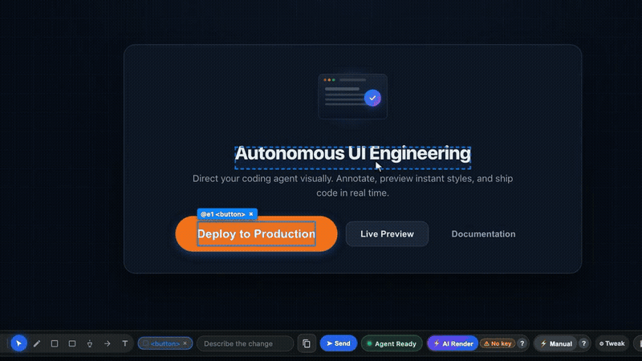
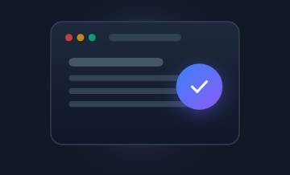
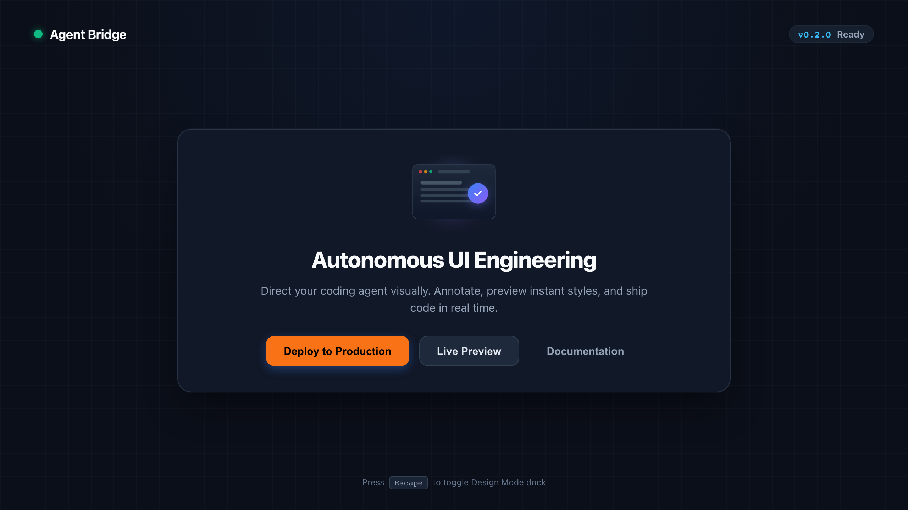

# Debug Bridge

[](https://github.com/stevengonsalvez/agent-bridge/releases/download/v0.3.2/debug-bridge-launch.mp4)

Let an AI coding agent see, drive, and receive visual change requests from your web app, with no changes to the app.

Debug Bridge launches a managed Chrome through a CDP sidecar, gives the agent numbered element handles (`@e1`, `@e2`), and shows a Design Mode dock on every page. You click elements, draw on the page, describe a change, and press **Send**. The request, with screenshots and the selected elements' DOM context, lands in the agent's session.

```
┌───────────┐  Send   ┌──────────────┐  submit   ┌──────────────────┐
│ Design    │────────▶│ bridge :4000 │──────────▶│ browser wait     │
│ Mode dock │         │ + CDP sidecar│           │ (agent, bg job)  │
└───────────┘         └──────┬───────┘           └────────┬─────────┘
      ▲                      │ CDP                        ▼
      │               ┌──────┴───────┐             agent edits code,
      └───────────────│ managed Chrome│◀── your app  then re-arms wait
                      └──────────────┘
```

## Quick Start (tutorial, zero-instrumentation sidecar)

You need Node.js and Chrome installed. Your app only has to be reachable at a URL (for example a dev server on `http://localhost:5173`).

> The published `debug-bridge-cli` on npm is 0.1.2 and has only the `connect` command (no `browser`, `design-mode`, or `skill` commands). This repo is 0.2.0. Until a new release is published, build the CLI from this repo (see [Development](#development)) and run it as `node packages/cli/dist/bin/cli.js`. The examples below write `debug-bridge` for either form.

### 1. Open your app in the managed browser

```bash
debug-bridge browser open "http://localhost:5173" --port 4000
```

If no bridge is listening on that port, this command starts the bridge and the managed browser itself and keeps running (Ctrl+C stops both). Run it in its own terminal or in the background. If a bridge is already running (for example from `debug-bridge connect --cdp`), it just navigates. Design Mode turns on automatically. Page URLs stay clean, no `?session=` or `?port=` query parameters are needed.

### 2. Inspect and control the page

```bash
debug-bridge browser snapshot --port 4000                     # numbered handles @e1, @e2, ...
debug-bridge browser click @e1 --port 4000
debug-bridge browser fill @e2 "user@example.com" --port 4000
debug-bridge browser screenshot --out ./screenshot.png --port 4000
debug-bridge browser preview-patch --css "button { background: #2563eb !important; }" --port 4000
```

### 3. Receive change requests from the dock

In a second terminal, block until the dock's **Send** fires:

```bash
debug-bridge browser wait --port 4000
```

Select an element in the browser, type a change in the dock, and press **Send**. `wait` prints the request, saves visual artifacts to disk, and exits `0`.

#### What the Agent Receives

When **Send** fires, Debug Bridge captures the prompt and packages both full-page and element-level artifacts:

```text
Waiting for Design Mode request on session "default"...

DESIGN MODE REQUEST
Change:  make hero illustration 3D glowing isometric
Page:    http://localhost:5173
clean_screenshot_path: /tmp/debug-bridge/demo-page-screenshot.png
element_screenshot_paths: /tmp/debug-bridge/demo-element-image.png
context_json_path: /tmp/debug-bridge/context.json

Prompt:
/tmp/debug-bridge/demo-element-image.png make hero illustration 3D glowing isometric

Page: http://localhost:5173
Details: /tmp/debug-bridge/context.json
```

#### Captured Visual Artifacts

Debug Bridge generates targeted visual artifacts so multimodal agents inspect exact component pixels:

| Artifact | Type | Description |
|---|---|---|
| `demo-element-image.png` | **Element Crop (Image Only)** | Sharp, focused screenshot of only the selected target element |
| `demo-page-screenshot.png` | **Full Viewport** | Clean full-page screenshot without overlays |

<p align="center">
  
  <br />
  <em>Element Screenshot: isolated crop of only the target image element</em>
</p>

<p align="center">
  
  <br />
  <em>Full Page Screenshot: clean viewport reference</em>
</p>

#### Agent Inspection and Closing the Loop

The agent opens the element screenshot, reads the context, applies the code change, and reports completion back to the dock:

```bash
# 1. Open and inspect the element screenshot
open /tmp/debug-bridge/demo-element-image.png

# 2. Re-arm the inbox before editing code so subsequent requests are not missed
debug-bridge browser wait --port 4000 &

# 3. Edit source files, verify with a screenshot, and report done
debug-bridge browser design-mode done "Updated hero illustration" --port 4000 --session default
```

See [docs/agent-loop.md](./docs/agent-loop.md) for how an agent runs this in an autonomous loop.

## Documentation map

| Need | Document | Type |
|------|----------|------|
| Run the agent loop (open, arm wait, re-arm, handle, report done) | [docs/agent-loop.md](./docs/agent-loop.md) | How-to |
| Stop prompts landing in the wrong tmux pane | [docs/tmux-injection.md](./docs/tmux-injection.md) | How-to |
| Every CLI command, flag, exit code, env var | [docs/cli-reference.md](./docs/cli-reference.md) | Reference |
| The Design Mode dock, status pill, artifacts | [docs/design-mode-dock.md](./docs/design-mode-dock.md) | Reference |
| Persistent profiles, storage state, privacy | [docs/browser-profiles.md](./docs/browser-profiles.md) | How-to |
| Feedback batches and the feedback MCP server | [docs/ui-feedback-annotation.md](./docs/ui-feedback-annotation.md) | Reference |
| How the pieces fit together | [docs/architecture.md](./docs/architecture.md) | Explanation |
| Validate the sidecar end to end | [docs/cdp-sidecar-demo.md](./docs/cdp-sidecar-demo.md) | How-to |
| Cut a release / publish the plugin | [docs/releasing.md](./docs/releasing.md) | How-to |
| Wire protocol (SDK app messages; sidecar messages are in `packages/types/src/messages/browser.ts`) | [spec.md](./spec.md) | Reference |

## Packages

| Package | Description | Status |
|---------|-------------|--------|
| [`debug-bridge-cli`](./packages/cli/README.md) | CLI: bridge server, browser commands, `browser wait` | Repo 0.2.0, npm 0.1.2 |
| `debug-bridge-browser-sidecar` | Playwright CDP sidecar provider (used by the CLI) | Workspace package |
| [`debug-bridge-skill`](./packages/skill/README.md) | Skill installer package | Not published to npm |
| `debug-bridge-feedback-mcp` | MCP server for feedback batches | Workspace package |
| [`debug-bridge-browser`](./packages/browser/README.md) | Optional in-app SDK and the Design Mode runtime | Optional |
| [`debug-bridge-types`](./packages/types/README.md) | TypeScript protocol definitions | Shared |

Check what is actually on npm with `npm view <name> version` before running an install command from this table.

## How It Works

1. **Zero-instrumentation sidecar (default).** The bridge server and a Playwright CDP sidecar control any web app from outside. Handles, screenshots, console, network, and cookies all come over CDP.
2. **Design Mode dock.** The sidecar injects a dock into every page it opens. It supports element selection, drawing, quick-render CSS previews, and Send to agent. Details in [docs/design-mode-dock.md](./docs/design-mode-dock.md).
3. **Agent inbox.** `debug-bridge browser wait` is the agent's listener for Send. Optionally the sidecar also types the prompt into a tmux pane when Send is pressed ([docs/tmux-injection.md](./docs/tmux-injection.md)).
4. **Embedded SDK (optional).** For apps that want custom state providers or in-app telemetry. Not needed for the flow above.

## Optional: Embedded Browser SDK

Only needed for custom state providers and in-app telemetry. The sidecar flow does not require it.

```bash
npm install debug-bridge-browser
```

```typescript
import { createDebugBridge } from 'debug-bridge-browser';

if (import.meta.env.DEV) {
  const bridge = createDebugBridge({
    url: 'ws://localhost:4000/debug?role=app&sessionId=default',
    sessionId: 'default',
    appName: 'My App',
  });
  bridge.connect();
}
```

All options are listed in [packages/browser/README.md](./packages/browser/README.md).

## AI Agent Integration

### Install the skill

Install the Debug Bridge skill straight from GitHub into every agent (Claude Code, Codex, Cursor, Gemini/Antigravity, OpenCode and more) with the [`skills`](https://www.npmjs.com/package/skills) CLI:

```bash
# Global: installs into ~/.agents/skills/debug-bridge and links agents as needed
npx skills add stevengonsalvez/agent-bridge --skill debug-bridge -g -y

# Current project only
npx skills add stevengonsalvez/agent-bridge --skill debug-bridge -y
```

This installs `SKILL.md` from `master`; re-run it to update.

`debug-bridge-skill` is not published to npm, so `npx debug-bridge-skill` does not work today, and the published 0.1.2 CLI has no `skill` command. Use the `npx skills add` commands above. See [packages/skill/README.md](./packages/skill/README.md).

#### Claude Code plugin marketplace (alternative)

```bash
/plugin marketplace add stevengonsalvez/agent-bridge
/plugin install debug-bridge@agent-bridge-marketplace
```

After installation, trigger the skill with phrases such as "debug the app", "inspect the UI", "design mode", "take a screenshot of the page".

### What the skill makes the agent do

The skill ([`skills/debug-bridge/SKILL.md`](./skills/debug-bridge/SKILL.md)) requires the agent to arm the inbox on every run, so you never have to go back to the chat and ask "did you get it?":

```
open page ─▶ arm `browser wait` (background) ─▶ request arrives (exit 0)
                    ▲                                     │
                    └──── 1. re-arm wait ◀────────────────┤
                                                          ▼
                          2. apply + verify ─▶ 3. design-mode done "<summary>"
```

Full walkthrough: [docs/agent-loop.md](./docs/agent-loop.md).

### Programmatic WebSocket API

`browser wait` is a thin client over the bridge WebSocket. Connect as an agent listener and watch for `browser_design_mode_submit` messages:

```javascript
import { WebSocket } from 'ws';

const ws = new WebSocket('ws://localhost:4000/debug?role=agent&listener=1&sessionId=default');
ws.on('message', (raw) => {
  const msg = JSON.parse(raw.toString());
  if (msg.type === 'browser_design_mode_submit') console.log(msg.requestedChange, msg.url);
});
```

Sidecar and `browser_*` message shapes are in [`packages/types/src/messages/browser.ts`](./packages/types/src/messages/browser.ts) (see also [packages/types](./packages/types/README.md)). [spec.md](./spec.md) covers the SDK app protocol only.

## Development

```bash
pnpm install
pnpm run build        # build all packages (turbo)
pnpm run type-check
pnpm test             # type-check, build, then the scripted validations
```

Run the built CLI without installing it:

```bash
node packages/cli/dist/bin/cli.js --help
```

Sample app for manual testing: [apps/sample-react-app/README.md](./apps/sample-react-app/README.md).

## License

MIT
